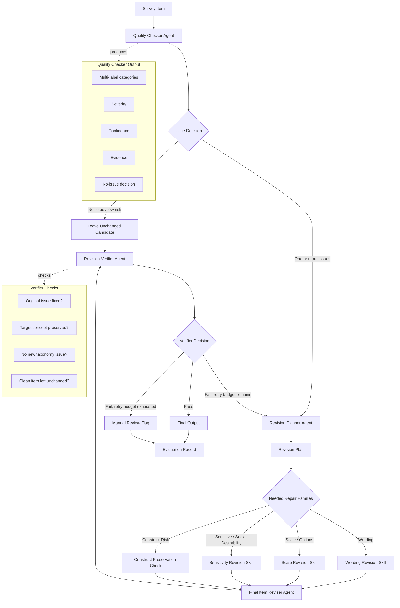
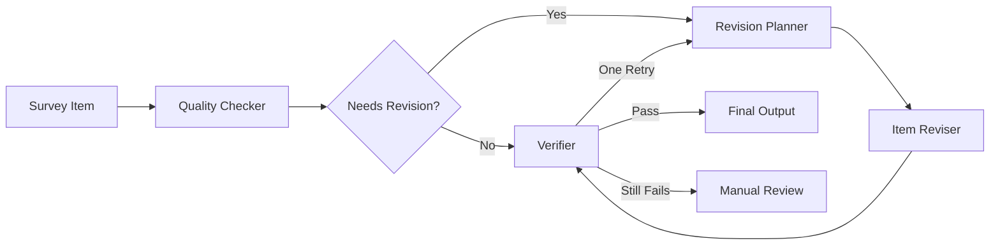

# Item Reviser Orchestration Diagram

This diagram sketches the proposed LLM-agent orchestration for the item-reviser pipeline.
The core idea is to avoid a brittle single-label router and instead use a multi-label
quality check, a revision plan, targeted revision, and verification.



## Agent Responsibility Matrix

| Stage | Main Job | Output | Main Failure To Guard Against |
|---|---|---|---|
| Quality Checker | Detect all relevant taxonomy issues, or decide no issue | Multi-label issue list with evidence and confidence | Missing multi-error items or over-flagging clean items |
| Revision Planner | Convert detected issues into repair actions | Ordered revision plan | Jumping directly to a bad rewrite without preserving intent |
| Revision Skills | Apply targeted fixes by issue family | Candidate repair instructions or partial rewrite | Treating every taxonomy category as a separate agent |
| Final Reviser | Produce one coherent revised item | Revised question, response options, notes, changed flag | Patchwork revisions that conflict with each other |
| Verifier | Audit the revised item against original and taxonomy | Pass, retry, or manual review | Accepting a fluent but concept-drifting revision |

## Minimal MVP Version



## Suggested Internal State

```json
{
  "detected_issues": [
    {
      "category": "leading_question",
      "family": "wording",
      "severity": "high",
      "confidence": 0.86,
      "evidence": "Don't you agree",
      "repair_strategy": "neutralize wording"
    }
  ],
  "decision": {
    "needs_revision": true,
    "reason": "High-confidence wording issue detected."
  },
  "revision_plan": [
    "Rewrite as a neutral support/oppose question.",
    "Use balanced item-specific response options."
  ],
  "verifier": {
    "status": "pass",
    "remaining_retry_budget": 1
  }
}
```
