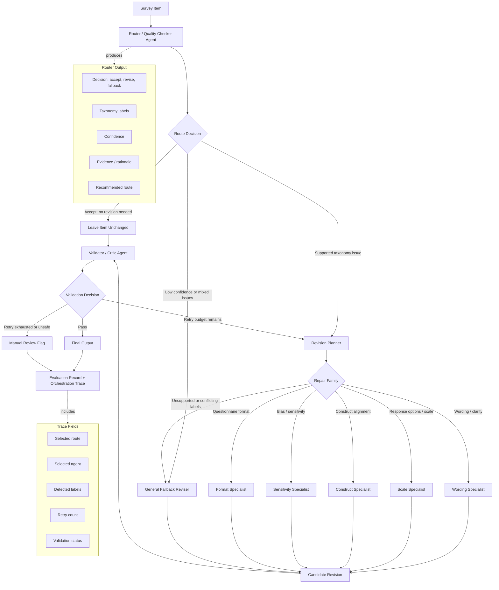

# Item Reviser Orchestration Diagram

This document is the canonical target architecture for the LLM-agent orchestration
system in the item-reviser pipeline. The implementation may be delivered in phases,
but those phases are incremental steps toward this full workflow, not separate MVP
architectures.


```mermaid
flowchart TD
    A[Survey Item] --> B[Router / Quality Checker Agent]

    B --> C{Route Decision}
    C -->|Accept: no revision needed| D[Leave Item Unchanged]
    C -->|Low confidence or mixed issues| E[General Fallback Reviser]
    C -->|Supported taxonomy issue| F[Revision Planner]

    F --> G{Repair Family}
    G -->|Wording / clarity| H[Wording Specialist]
    G -->|Response options / scale| I[Scale Specialist]
    G -->|Construct alignment| J[Construct Specialist]
    G -->|Bias / sensitivity| K[Sensitivity Specialist]
    G -->|Questionnaire format| L[Format Specialist]
    G -->|Unsupported or conflicting labels| E

    H --> M[Candidate Revision]
    I --> M
    J --> M
    K --> M
    L --> M
    E --> M
    D --> N[Validator / Critic Agent]
    M --> N

    N --> O{Validation Decision}
    O -->|Pass| P[Final Output]
    O -->|Retry budget remains| F
    O -->|Retry exhausted or unsafe| Q[Manual Review Flag]

    P --> R[Evaluation Record + Orchestration Trace]
    Q --> R

    subgraph RouterOutput[Router Output]
        B1[Decision: accept, revise, fallback]
        B2[Taxonomy labels]
        B3[Confidence]
        B4[Evidence / rationale]
        B5[Recommended route]
    end

    subgraph TraceFields[Trace Fields]
        R1[Selected route]
        R2[Selected agent]
        R3[Detected labels]
        R4[Retry count]
        R5[Validation status]
    end

    B -. produces .-> RouterOutput
    R -. includes .-> TraceFields
```

## Agent Responsibility Matrix

| Stage | Main Job | Output | Main Failure To Guard Against |
|---|---|---|---|
| Router / Quality Checker | Detect taxonomy issues, decide whether revision is needed, and select the route | Accept/revise/fallback decision with labels, confidence, evidence, and route | Forcing clean items into revision or over-trusting a brittle single-label classification |
| Revision Planner | Convert detected issues into an ordered repair plan | Repair family, selected specialist or fallback, and revision instructions | Jumping directly to a rewrite without preserving the intended construct |
| Specialist Revisers | Apply targeted fixes by issue family | Candidate revision for a specific issue family | Creating too many tiny agents or allowing specialists to change the construct |
| General Fallback Reviser | Handle low-confidence, mixed, unsupported, or ambiguous cases | Candidate revision with fallback trace metadata | Dropping hard cases because the router cannot classify them cleanly |
| Validator / Critic | Check the candidate against the original item and detected issues | Pass, bounded retry, or manual review | Accepting fluent but concept-drifting revisions |
| Evaluation Recorder | Persist route, labels, confidence, selected agent, retry count, and validation status | Evaluation row with orchestration trace | Making orchestration behavior impossible to audit later |

## Phased Implementation Note

The full workflow above should be implemented incrementally:

1. Add orchestration schemas, config, prompt slots, and trace objects while preserving current default behavior.
2. Add the router / accept gate.
3. Add the general fallback reviser path.
4. Add the first specialist revisers and taxonomy-to-agent routing.
5. Add validator retries, trace fields, evaluation output, and documentation.

These phases describe delivery order only. They should not introduce a separate MVP
workflow or a competing diagram.

## Suggested Internal State

```json
{
  "router": {
    "decision": "revise",
    "taxonomy_labels": ["leading_question"],
    "confidence": 0.86,
    "evidence": "The item nudges respondents toward agreement.",
    "recommended_route": "wording_clarity"
  },
  "revision_plan": {
    "repair_family": "wording_clarity",
    "selected_agent": "wording_specialist",
    "instructions": [
      "Rewrite the item using neutral wording.",
      "Preserve the original construct and intended measurement target."
    ]
  },
  "validator": {
    "status": "pass",
    "remaining_retry_budget": 1,
    "rationale": "The revised item removes the leading phrasing and preserves the construct."
  },
  "trace": {
    "route": "specialist",
    "selected_agent": "wording_specialist",
    "retry_count": 0,
    "final_status": "accepted"
  }
}
```
